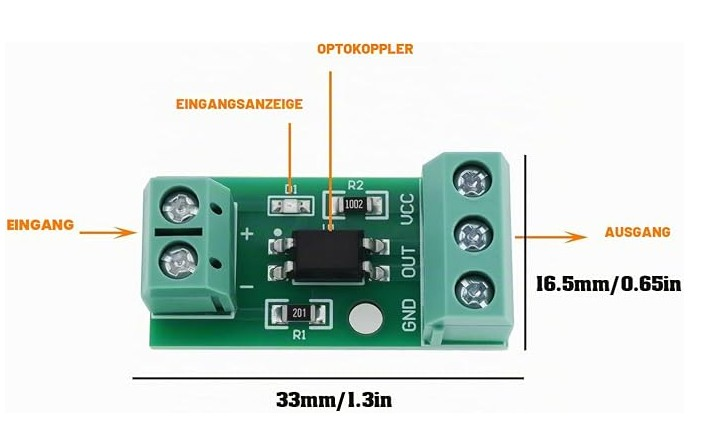

# ESP32 Kenwood Bridge (MQTT -> Lenkrad-Fernbedienung)

Steuert ein Kenwood Autoradio (getestet gedacht für das DMX8019DABS) aus `homectld` heraus.
Der ESP32 hängt am Lenkrad-Fernbedienungs-Eingang des Radios und simuliert dort Tastendrücke,
zusätzlich liest er über P.CONT ob das Radio an ist. Aufbau und MQTT Schnittstelle folgen
`alpicool/alpicool.ino`.

## Funktionsweise

Der Kenwood Eingang "Steering Wheel Remote" (hellblau/gelb) liegt im Radio auf 3,3 V. Ein Sender
zieht ihn nach Masse und überträgt so das NEC Protokoll der Kenwood IR-Fernbedienung, nur
invertiert und ohne 38 kHz Träger. Das ist eine Einbahnstraße: Tasten lassen sich senden,
Zustände (Lautstärke, Quelle, Titel) kommen nicht zurück. Einzige Rückmeldung ist der
P.CONT Ausgang des Radios, der 12 V führt solange das Radio an ist (auch nicht im Standby).

## Hardware

Verwendet werden zwei 1-Kanal PC817 Optokoppler-Module (3-5 V, Eingang +/-, Ausgang VCC/OUT/GND).
Aufbau des Moduls: + -> 200 Ohm (R1) -> Anzeige-LED -> LED des PC817 -> -, am Ausgang liegt der
Kollektor an OUT mit 10k (R2) Pull-up nach VCC, der Emitter an GND. OUT ist high in Ruhe und geht
auf Masse sobald am Eingang Strom fließt.



| Radio                                  | Modul                    | ESP32                                   |
| :------------------------------------- | :----------------------- | :-------------------------------------- |
| Steering Remote (hellblau/gelb)        | Modul 1: OUT             | Modul 1: + an GPIO 25, - an GND         |
| Masse                                  | Modul 1: GND, Modul 2: - | GND                                  |
| P.CONT / ANT.CONT (blau/weiß, 12 V)    | Modul 2: + über 2,2k     | Modul 2: OUT an GPIO 34, VCC an 3V3, GND an GND |
| ACC (rot), optional                    |                          | Relaismodul an `AccRelayPin`            |

```
            ESP32                           PC817 Modul 1                        Kenwood Radio
       +---------------+               +---------------------+
       |     GPIO 25   |---------------| +              VCC  |----------------o (frei lassen)
       |  (RemotePin)  |               |                OUT  |----------------o  Steering Remote (hellblau/gelb)
       |         GND   |---------------| -              GND  |----------------o  Masse (schwarz)
       |               |               +---------------------+
       |               |
       |               |                    PC817 Modul 2
       |               |               +---------------------+
       |         3V3   |---------------| VCC              +  |-----[2,2k]-----o  P.CONT/ANT.CONT (blau/weiss, 12V = Radio an)
       |     GPIO 34   |---------------| OUT                 |
       |(PowerSensePin)|       +-------| GND              -  |----------------o  Masse (schwarz)
       |         GND   |-------+       +---------------------+
       |               |
       |               |         Relais in der ACC Leitung (optional)
       |               |                     +---------+
       |  AccRelayPin  |-------------------->| Relais- |  Versorgung 5 V / GND
       |               |                     | modul   |
       |               |                     +---------+
       |               |                                Schaltkontakt (NO)
       |               |       Zündung / ACC Plus  o---------o / o---------o  ACC (rot, Radio)
       |    5V  GND    |
       +----+----+-----+
            |    |
       +----+----+-----+
       |   12V -> 5V   |
       |   Wandler     |
       +----+----+-----+
            |    |
            o    |
           12V   |
                 o
               Masse
```

* **Modul 1, Lenkraddraht**: GPIO 25 an +, GND an -. Bei 3,3 V fließen etwa 2 mA, das reicht dem
  PC817. OUT zieht den Draht auf Masse, das ist der NEC 'mark', also `RemoteMarkLevel {HIGH}`.
  VCC frei lassen, der Draht wird vom Radio selbst auf 3,3 V gehalten. Der GPIO darf den Draht
  **niemals direkt** treiben, er hängt im Radio am selben Pin wie der IR-Empfänger.
* **Modul 2, P.CONT**: Ohne Vorwiderstand würden bei 12 V rund 45 mA durch die LED fließen, an der
  Grenze des PC817. Mit 2,2k in Reihe sind es bei 12 bis 14,4 V etwa 4 bis 5 mA. VCC an 3V3 des
  ESP32, dann liefert der interne 10k Pull-up den Ruhepegel, OUT ist low sobald das Radio an ist,
  daher `PowerSenseInvert {true}`. GPIO 34 hat keine internen Pull-Widerstände, der Pull-up des
  Moduls übernimmt das. Die Anzeige-LED des Moduls leuchtet solange P.CONT 12 V führt.
* **ACC Relais**: Relaismodul mit 3,3 V tauglichem Eingang oder Low-Level-Trigger verwenden
  (`AccRelayOnLevel` passend setzen). Während des Bootens ist der GPIO offen, ein High-Trigger
  Modul wäre in dem Moment eingeschaltet.
* Versorgung des ESP32 aus Dauerplus (12 V -> 5 V Wandler), damit er das Radio auch einschalten kann.
* Pins und Pegel werden in `config-tmpl.h` eingestellt (`RemotePin`, `RemoteMarkLevel`,
  `PowerSensePin`, `PowerSenseInvert`, `AccRelayPin`, `AccRelayOnLevel`).

## Abhängigkeiten & Vorbereitung

```bash
make install-deps      # ESP32 Core, PubSubClient, ArduinoJson
```

Vor dem Kompilieren müssen im übergeordneten Ordner in `Make.user` WLAN und MQTT Broker
eingestellt sein:

```
WIFI_SSID = foo
WIFI_PWD = foobar
MQTT_HOST = 192.168.100.10
```

```bash
make            # kompilieren
make upload     # flashen (Port im Makefile, Standard /dev/ttyACM0)
make clean
```

Serielle Konsole zur Diagnose:
`while true; do picocom -b 115200 /dev/ttyACM0 && break; sleep 0.1; done` (beenden mit Strg-A, Strg-X)

## Einrichtung in homectld

Im WEBIF unter Setup -> MQTT das Topic `homectld2mqtt/kenwood` in
"Zusätzliche sensor Topics" eintragen (Komma getrennt zu den vorhandenen), homectld neu starten.
Danach erscheinen die Sensoren vom Typ `KENWOOD` in der Sensorliste und können aktiviert werden.

Die Parameter des ESP32 (Codes, Schwellen) tauchen unter Setup -> Sensors als
`KENWOOD:<deviceid>` auf. Nach dem Ändern homectld neu starten, der Daemon schickt die
Konfiguration dann per init Paket an den ESP32, ein neues Flashen ist nicht nötig.

## Sensoren / Adressen

Alle Adressen sind vom Typ `KENWOOD`, Kind `status`, mit Rechten `control`.
Tasten haben keinen Zustand, sie melden immer `false` und lösen beim Schalten einen Tastendruck aus.

| Adresse | Titel      | NEC Code | Bemerkung                                         |
| :------ | :--------- | :------- | :------------------------------------------------ |
| 0       | Radio      | `codePower` (unbekannt) | Zustand aus P.CONT, schalten siehe unten |
| 1       | Volume +   | 0x14     | `value` = Anzahl Schritte (Standard 1, max 20)    |
| 2       | Volume -   | 0x15     | `value` = Anzahl Schritte                         |
| 3       | ATT        | 0x16     | Toggle, kein Zustand bekannt                      |
| 4       | Source     | 0x13     | Quelle weiterschalten                             |
| 5       | Track +    | 0x0B     | Titel / Sender / Preset vor                       |
| 6       | Track -    | 0x0A     | zurück                                            |
| 7       | Play/Pause | 0x0E     |                                                   |
| 8       | Answer     | unbekannt | Anruf annehmen, Code per Config nachtragen       |
| 9       | Hang up    | unbekannt | Auflegen                                          |
| 10      | Voice      | unbekannt | Sprachassistent                                   |

Die Codes stammen aus Projekten mit älteren Kenwood Geräten (Adresse 0xB9). Lautstärke, Source,
ATT und Track sind seit Jahren stabil, die übrigen müssen am Gerät geprüft werden.

### Radio ein-/ausschalten (Adresse 0)

* Ist ein ACC Relais konfiguriert (`AccRelayPin`), folgt das Relais dem Sollwert. Das Radio
  bootet beim Einschalten neu (10 bis 20 s).
* Ohne Relais bzw. wenn das Relais bereits richtig steht, wird bei Abweichung von Soll und
  Ist (P.CONT) der Power/Standby Code `codePower` gesendet. Da der Ist-Zustand bekannt ist,
  kippt ein Toggle-Code nicht in die falsche Richtung.
* Ist `codePower` unbekannt (-1) und kein Relais vorhanden, wird nur eine Warnung geloggt.

## MQTT Payloads

Kommandos an `homectld2mqtt/kenwood/in`:

```json
{"type": "KENWOOD", "address": 1, "value": 3}                      Volume + dreimal
{"type": "KENWOOD", "address": 0, "value": 1}                      Radio an
{"type": "KENWOOD", "action": "raw", "code": 29, "count": 1}       beliebigen Code testen
{"type": "KENWOOD", "action": "requestinit"}                       init Paket erneut anfordern
{"type": "KENWOOD", "action": "init", "config": {"codeAnswer": 28, "keyGap": 120}}
```

Zustände an `homectld2mqtt/kenwood`:

```json
{"type":"KENWOOD","address":0,"state":true,"kind":"status","title":"Radio"}
```

Log an `homectld2mqtt/kenwood/log`, Format wie bei alpicool.

### Konfigurationsparameter (init Paket)

| Parameter        | Standard | Bedeutung                                              |
| :--------------- | :------- | :----------------------------------------------------- |
| `eloquence`      | 3        | Log-Level Bitmaske (1 Info, 2 Detail, 4 Debug)         |
| `interval`       | 60       | Sekunden zwischen zyklischen Zustandsmeldungen         |
| `keyGap`         | 100      | ms Pause zwischen wiederholten Tastendrücken           |
| `powerThreshold` | 1000     | mV am ADC ab dem P.CONT als "an" gilt                  |
| `codePower`      | -1       | NEC Code der Power/Standby Taste                       |
| `codeVolumeUp` .. `codeVoice` | siehe Tabelle | NEC Code der jeweiligen Taste, -1 = unbekannt |

## Fehlende Codes finden

Mit `raw` lassen sich Codes durchprobieren, das Radio reagiert unmittelbar:

```bash
for c in $(seq 23 63); do
   echo "code $c"
   mosquitto_pub -h 192.168.100.10 -t homectld2mqtt/kenwood/in -m "{\"type\":\"KENWOOD\",\"action\":\"raw\",\"code\":$c}"
   sleep 3
done
```

Alternativ die Codes der Fernbedienung KCA-RCDV340 mit einem IR-Empfänger (TSOP38238) und
einer NEC-Decoder-Bibliothek mitlesen. Gefundene Codes im WEBIF unter Setup -> Sensors in
`KENWOOD:<deviceid>` eintragen und homectld neu starten.

## LED Status

| LED-Verhalten          | Bedeutung                                   |
| :--------------------- | :------------------------------------------ |
| Langsames Blinken (1s) | WLAN wird gesucht                           |
| Blinken (500ms)        | WLAN steht, MQTT Broker wird gesucht        |
| Dauerhaft AN (gedimmt) | WLAN und MQTT verbunden, Betrieb            |
