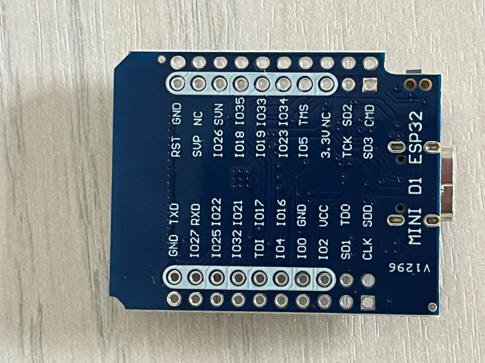

# ESP32 Kenwood Bridge (MQTT -> Lenkrad-Fernbedienung)

Steuert ein Kenwood Autoradio (getestet gedacht für das DMX8019DABS) aus `homectld` heraus.
Der ESP32 hängt am Lenkrad-Fernbedienungs-Eingang des Radios und simuliert dort Tastendrücke,
zusätzlich liest er über P.CONT ob das Radio an ist. Aufbau und MQTT Schnittstelle folgen
`alpicool/alpicool.ino`.

Eine Lenkrad-Fernbedienung per ESP-NOW ist in [README-remote.md](README-remote.md) beschrieben, der
Sketch dafür liegt in `kenwood-remote/`. Der Empfänger in diesem Sketch ist nur aktiv, wenn in
`Make.user` die WLAN-MAC des Bedienteils gesetzt ist (`KENWOOD_REMOTE_MAC`), sonst bleibt ESP-NOW aus.
Empfangene Tastendrücke laufen über dieselbe Logik wie die MQTT-Kommandos und werden an homectld gemeldet.

## Funktionsweise

Der Kenwood Eingang "Steering Wheel Remote" (hellblau/gelb) liegt im Radio auf 3,3 V. Ein Sender
zieht ihn nach Masse und überträgt so das NEC Protokoll der Kenwood IR-Fernbedienung, nur
invertiert und ohne 38 kHz Träger. Das ist eine Einbahnstraße: Tasten lassen sich senden,
Zustände (Lautstärke, Quelle, Titel) kommen nicht zurück. Einzige Rückmeldung ist der
P.CONT Ausgang des Radios, der 12 V führt solange das Radio an ist (auch nicht im Standby). Er ist
optional (`PowerSensePin {-1}`), ohne ihn gilt der Zustand des ACC Relais als Zustand des Radios.

## Hardware

Verwendet werden zwei 1-Kanal PC817 Optokoppler-Module (3-5 V, Eingang +/-, Ausgang VCC/OUT/GND).
Aufbau des Moduls: + -> 200 Ohm (R1) -> Anzeige-LED -> LED des PC817 -> -, am Ausgang liegt der
Kollektor an OUT mit 10k (R2) Pull-up nach VCC, der Emitter an GND. OUT ist high in Ruhe und geht
auf Masse sobald am Eingang Strom fließt.


Als ESP32 kommt ein Wemos "MINI D1 ESP32" zum Einsatz. Die Pinbezeichnungen unten entsprechen dem
Aufdruck auf der Platine, die Zuordnung zu den GPIO Nummern des Sketches ist:



| Aufdruck | GPIO | Verwendung                                                     |
| :------- | :--- | :------------------------------------------------------------- |
| IO25     | 25   | `RemotePin`, an + von Modul 1 (obere Reihe, außen)             |
| IO34     | 34   | `PowerSensePin`, an OUT von Modul 2 (untere Reihe, außen, nur Eingang) |
| IO27     | 27   | Vorschlag für `AccRelayPin`, direkt neben IO25                 |
| IO2      | 2    | `StatusLedPin`, blaue LED auf der Platine                      |
| 3.3V     |       | an VCC von Modul 2 (untere Reihe, innen)                        |
| VCC      |      | 5 V Eingang vom Wandler (obere Reihe, innen)                    |
| GND      |      | dreimal vorhanden: obere Reihe außen und innen, untere Reihe innen (neben RST) |

Lage der Pins, Ansicht von oben auf die Bauteilseite, USB Buchse unten, Antenne des ESP32 Moduls von oben.

```
                                         +--------------------------------------------+
                                         |                  ESP32                     |
                                         |                                            |
                                     GND | o  o RST                    IO1 (TXD) o  o | GND
                                      NC | o  o IO36 (SVP)             IO3 (RXD) o  o | IO27       <- IO27: (in) Relais Modum (optional)
                              IO39 (SVN) | o  o IO26                        IO22 o  o | IO25       <- IO25: (+) von Modul 1
                                    IO35 | o  o IO18                        IO21 o  o | IO32
                                    IO33 | o  o IO19                        IO17 o  o | IO12 (TDI)
     IO34: OUT von Modul 2 ->       IO34 | o  o IO23                        IO16 o  o | IO4
                              IO14 (TMS) | o  o IO5                          GND o  o | IO0        <- GND: Masse / (-) von Modul 1 / GND von Modul 2
     3.3V VCC von MOdule 2 ->         NC | o  o 3.3V                         VCC o  o | IO2        <- VCC: 5V vom Wandler / 3.3V (links innen): VCC von Modul 2
                               IO9 (SD2) | o  o IO13 (TCK)            IO15 (TDO) o  o | IO8 (SD1)
                              IO11 (CMD) | o  o IO10 (SD3)             IO7 (SD0) o  o | IO6 (CLK)
                                         |                                            |
                                         |                  [ USB ]                   |
                                         +--------------------------------------------+
```
IO6 bis IO11 (CLK, CMD, SD0 bis SD3) gehören zum Flash und sind nicht nutzbar.
IO34 bis IO39 sind reine Eingänge.

| Radio                                  | Modul                    | ESP32                                   |
| :------------------------------------- | :----------------------- | :-------------------------------------- |
| Steering Remote (hellblau/gelb)        | Modul 1: OUT             | Modul 1: + an IO25, - an GND, VCC an VCC (5 V) |
| Masse                                  | Modul 1: GND, Modul 2: - | GND                                  |
| P.CONT / ANT.CONT (blau/weiß, 12 V)    | Modul 2: + über 2,2k     | Modul 2: OUT an IO34, VCC an 3.3V, GND an GND |
| ACC (rot), optional                    |                          | Relaismodul an `AccRelayPin` (z.B. IO27) |

Aderfarben am Kabelbaum des Radios:

| Ader                               | Farbe          |
| :--------------------------------- | :------------- |
| Dauerplus (Batterie)               | gelb           |
| Zündung / ACC                      | rot            |
| Masse                              | schwarz        |
| P.CONT / ANT.CONT (12 V wenn an)   | blau/weiß      |
| Steering Remote (Lenkraddraht)     | hellblau/gelb  |
| MUTE (Masse = stumm)               | braun          |
| Beleuchtung (ILLUMI)               | orange/weiß    |
| Rückfahrsignal (REVERSE)           | lila/weiß      |
| Handbremse (PRK SW)                | hellgrün       |

```
       MINI D1 ESP32                        PC817 Modul 1                        Kenwood Radio
       +---------------+               +---------------------+
       |   VCC (5V)    |---------------| VCC                 |
       |     IO25      |---------------| (+)                 |     (gelb)
       |  (RemotePin)  |               |                OUT  |----------------o  Steering Remote (hellblau/gelb)
       |         GND   |---------------| (-)            GND  |----------------o  Masse (schwarz)
       |               |               +---------------------+
       |               |
       |               |                    PC817 Modul 2 (optional zu on/off Erkennung)
       |               |               +---------------------+   (schwarz)
       |     3.3V      |---------------| VCC             (+) |-----[2,2k]-----o  P.CONT/ANT.CONT (blau/weiss, 12V = Radio an)
       |     IO34      |---------------| OUT                 |
       |(PowerSensePin)|       +-------| GND             (-) |----------------o  GND
       |               |       |       +---------------------+
       |          GND  |-------+
       |               |
       |               |         Relais in der Radio ACC Leitung (optional)
       |               |                     +---------------+
       | IO27          |                     | Relais 5V     |
       | (AccRelayPin) |---------------------| IN        DC+ |  5V+
       |               |                     | Jumper:H  DC- |  GND
       |               |                     +---------------+
       |               |                             .
       |               |                             .          1N4007
       |               |            +12V o---------o / o---------->|-----+   (rot)
       |               |                         COM   NO                +----------o  ACC (Radio/rot)
       |   VCC  GND    |       Zündung + o------------------------>|-----+
       +----+----+-----+                                        1N4007
            |    |
         (5V in) |
            |    |
       +----+----+-----+
       |   12V -> 5V   |
       |   Wandler     |
       +----+----+-----+
            |    |
            o    |
           12V   |
                 o
               Masse
```

* **Modul 1, Lenkraddraht**: IO25 an +, GND an -. Bei 3,3 V fließen etwa 2 mA, das reicht dem
  PC817. OUT zieht den Draht auf Masse, das ist der NEC 'mark', also `RemoteMarkLevel {HIGH}`.
  VCC des Moduls an den VCC-Pin (5 V) des ESP32: Das Radio hält den Draht in Ruhe mit einem
  hochohmigen Pull-up auf ca. 4,5 V, dagegen schaltet der Fototransistor so träge ab, dass die
  kurzen 560 µs Pausen nicht mehr den vollen Pegel erreichen und das Radio den Frame verwirft.
  Der 10k des Moduls parallel dazu macht die steigenden Flanken schnell genug.
  Der GPIO darf den Draht **niemals direkt** treiben, er hängt im Radio am selben Pin wie der IR-Empfänger.
* **Modul 2, P.CONT**: Ohne Vorwiderstand würden bei 12 V rund 45 mA durch die LED fließen, an der
  Grenze des PC817. Mit 2,2k in Reihe sind es bei 12 bis 14,4 V etwa 4 bis 5 mA. VCC an 3.3V des
  ESP32, dann liefert der interne 10k Pull-up den Ruhepegel, OUT ist low sobald das Radio an ist,
  daher `PowerSenseInvert {true}`. IO34 ist ein reiner Eingang ohne interne Pull-Widerstände, der Pull-up des
  Moduls übernimmt das. Die Anzeige-LED des Moduls leuchtet solange P.CONT 12 V führt.
  Wird zunächst ohne Modul 2 getestet, IO34 mit einer Drahtbrücke auf 3.3V legen. Offen liefert der
  Eingang Zufallswerte und der Sensor "Radio" flattert; mit der Brücke meldet er dauerhaft "aus".
* **ACC Relais**: 5 V Relaismodul mit Optokoppler und Jumper für High/Low-Trigger, Jumper auf H,
  `AccRelayOnLevel {HIGH}`. Im High-Trigger-Modus liegt die Optokoppler-LED zwischen IN und Masse,
  3,3 V am GPIO geben ca. 2 mA und ziehen das Relais sicher an, 0 V lassen es aus, auch während
  des Bootens bei offenem GPIO. Low-Trigger (Jumper L) funktioniert mit einem 3,3 V GPIO nicht
  zuverlässig: die LED liegt dann über 1k an 5 V, die verbleibenden 1,7 V bei GPIO high reichen
  aus, um das Relais angezogen zu halten (am Gerät so beobachtet). DC+ an den VCC-Pin
  (5 V) des ESP32, DC- an GND. Relaiskontakt (COM/NO) und Zündungsplus werden über je eine
  Diode auf den roten ACC-Draht geführt: Der Draht ist nur ein Erkennungseingang mit wenigen mA,
  die Versorgung kommt über Dauerplus gelb, 1N4007 genügt. Die Dioden verhindern, dass der
  Relaiskontakt den ACC-Kreis des Fahrzeugs speist und umgekehrt. Bei laufender Zündung ist das
  Radio damit immer an, bei stehender Zündung folgt es dem Relais.
* Versorgung des ESP32 aus Dauerplus (12 V -> 5 V Wandler) an den Pin VCC des D1 Mini, das ist der
  5 V Eingang vor dem Spannungsregler. Nicht an 3.3V einspeisen. So kann der ESP32 das Radio auch einschalten.
* Pins und Pegel werden in `config-tmpl.h` eingestellt (`RemotePin`, `RemoteMarkLevel`,
  `PowerSensePin`, `PowerSenseInvert`, `AccRelayPin`, `AccRelayOnLevel`).

## Abhängigkeiten & Vorbereitung

```bash
make install-deps      # ESP32 Core, PubSubClient, ArduinoJson
```

Vor dem Kompilieren müssen im übergeordneten Ordner in `Make.user` WLAN und MQTT Broker
eingestellt sein, dazu der serielle Port für das Flashen per USB und für OTA die IP des ESP32:

```
WIFI_SSID = foo
WIFI_PWD = foobar
MQTT_HOST = 192.168.100.10
KENWOOD_PORT = /dev/ttyACM0
KENWOOD_OTA_HOST = 192.168.100.177
KENWOOD_OTA_PWD =
KENWOOD_REMOTE_MAC =              # WLAN-MAC des Lenkrad-Bedienteils, leer = Empfänger aus
```

```bash
make              # kompilieren (baut nur neu wenn sich Sketch oder Konfiguration geändert haben)
make upload       # flashen per USB (KENWOOD_PORT)
make upload-ota   # flashen per WLAN (KENWOOD_OTA_HOST), sobald der ESP einmal läuft
make clean
```

Der erste Upload muss per USB erfolgen, danach meldet sich der ESP im WLAN als `kenwood-bridge`
und nimmt Updates über Port 3232 an. Ist `KENWOOD_OTA_PWD` gesetzt, wird es beim Upload verlangt. Während
des Updates wird der Lenkraddraht in Ruhe gehalten, danach startet der ESP neu.

Serielle Konsole zur Diagnose:
`while true; do picocom -b 115200 /dev/ttyACM0 && break; sleep 0.1; done` (beenden mit Strg-A, Strg-X)

Sobald die MQTT Verbindung steht, gehen alle Meldungen zusätzlich an das Log-Topic und lassen sich
ohne USB Kabel mitlesen:

```bash
mosquitto_sub -h 192.168.100.10 -t homectld2mqtt/kenwood/log -v
```

## Einrichtung in homectld

Im WEBIF unter Setup -> MQTT das Topic `homectld2mqtt/kenwood` in
"Zusätzliche sensor Topics" eintragen (Komma getrennt zu den vorhandenen), homectld neu starten.
Danach erscheinen die Sensoren vom Typ `KENWOOD` in der Sensorliste und können aktiviert werden.

Die Parameter des ESP32 (Codes, Schwellen) tauchen unter Setup -> Sensors als
`KENWOOD:<deviceid>` auf. Nach dem Ändern homectld neu starten, der Daemon schickt die
Konfiguration dann per init Paket an den ESP32, ein neues Flashen ist nicht nötig.

## Sensoren / Adressen

Alle Adressen sind vom Typ `KENWOOD`, mit Rechten `control`. Tasten sind Kind `status` ohne
Zustand, sie melden immer `false` und lösen beim Schalten einen Tastendruck aus. Rechte und
Widget-Parameter (Symbol, Farben) sendet der ESP nur mit der ersten Statusmeldung nach dem
MQTT-Connect und nach einem `requestinit` von homectld, das sie ohnehin nur beim Anlegen des
Sensors auswertet. Homectld fordert das init bei jedem Start an. Die Codes wurden
am DMX8019DABS mit `scancodes.sh` verifiziert (dezimal wie im Scan angezeigt):

| Adresse | Titel        | Code | Bemerkung                                                    |
| :------ | :----------- | :--- | :----------------------------------------------------------- |
| 0       | Power        | -    | Radio an/aus: Zustand aus P.CONT bzw. Relais, schalten nur über das ACC Relais, siehe unten |
| 1       | Volume +     | 20   | `value` = Anzahl Schritte (Standard 1, max 20)               |
| 2       | Volume -     | 21   | `value` = Anzahl Schritte                                    |
| 3       | ATT          | 22   | Toggle, kein Zustand bekannt                                 |
| 4       | Source       | 19   | Quelle weiterschalten, alle Quellen                          |
| 5       | Track +      | 10   | nächster Sender / Titel (nicht der nächste Preset)           |
| 6       | Track -      | 11   | zurück                                                       |
| 7       | Play/Pause   | 14   | ungeprüft, im Scan keine Reaktion bei Radioquelle            |
| 8       | Answer       | unbekannt | Anruf annehmen, im Scan ohne aktives Telefonat nicht gefunden |
| 9       | Hang up      | unbekannt | Auflegen                                                |
| 10      | Voice        | unbekannt | Sprachassistent                                         |
| 11      | Preset +     | 141  | nächster Preset                                              |
| 12      | Mute         | 91   | Toggle, unabhängig von ATT                                   |
| 13      | Source Tuner | 28   | Toggle DAB -> Radio -> Anzeige "Standby" (kein echter Standby, nächster Druck geht weiter) |
| 14      | Source Media | 30   | Toggle Spotify -> iPod -> Bluetooth                          |
| 15      | Source Video | 31   | Toggle HDMI -> AV-In                                         |
| 16      | FM Radio     | 253  | analoges Radio direkt                                        |
| 17      | Equalizer    | 130  | Toggle an/aus                                                |
| 18      | Preset       | 0..9 | Kind `text` mit Auswahl 1..9,0: `value` = Preset, sendet Code = Preset |
| 20..29  | Preset 0..9  | 0..9 | dieselben Presets als einzelne Tasten, z.B. für HASP Panels  |

Weitere Codes aus dem Scan, nicht als Sensor angelegt: 29 Quelle Disc (kein Laufwerk vorhanden)
und 131 Standby (siehe unten, gesperrt).

**Gesperrt**: 51 und 216 schalten das Radio in das Production Menu, aus dem es nur durch Aus- und
Einschalten zurück geht. 131 führt in den Standby, den sich das Radio über das Aus- und Einschalten
der Zündung hinweg merkt und aus dem es nur die Taste am Gerät zurückholt, im Standby wird der
Lenkraddraht nicht ausgewertet. Der Sketch sendet diese drei Codes nie, auch nicht per `raw`.

Die Codes 28 bis 31 sind die Direktwahltasten Tuner, Tape, CD und CD-Wechsler der alten Kenwood
Fernbedienungen. Das DMX bildet sie auf Quellengruppen ab und schaltet innerhalb der Gruppe weiter,
19 ist die klassische SRC Taste über alle Quellen.

### Radio ein-/ausschalten (Adresse 0)

* Geschaltet wird ausschließlich über das ACC Relais (`AccRelayPin`): Relais zu, das Radio bootet
  wie nach Zündung an (10 bis 20 s), Relais auf, es ist aus. Bei laufender Zündung hält die Diode am
  roten Draht das Radio unabhängig vom Relais an.
* Der Standby-Code 131 wird nicht verwendet: Das DMX merkt sich den Standby und stellt ihn nach dem
  nächsten Einschalten der Zündung wieder her, ein Einschalt-Code existiert nicht. Ein per Code
  ausgeschaltetes Radio käme nur über die Taste am Gerät zurück.
* Zustand: Mit P.CONT (`PowerSensePin` 34) meldet Adresse 0 den echten Zustand, auch bei Zündung an
  oder Standby per Taste. Ohne P.CONT (`PowerSensePin {-1}`) meldet sie den Relaiszustand.
* Ohne Relais (`AccRelayPin {-1}`) bleiben `codePowerOn` und `codePowerOff` als Option für andere
  Geräte, Standard -1, dann wird beim Schalten nur eine Warnung geloggt.

## MQTT Payloads

Kommandos an `homectld2mqtt/kenwood/in`:

```json
{"type": "KENWOOD", "address": 1, "value": 3}                      Volume + dreimal
{"type": "KENWOOD", "address": 0, "value": 1}                      Radio an
{"type": "KENWOOD", "action": "raw", "code": 29, "count": 1}       beliebigen Code testen
{"type": "KENWOOD", "action": "requestinit"}                       init Paket erneut anfordern
{"type": "KENWOOD", "action": "init", "config": {"codeAnswer": 28, "keyGap": 120}}
```

Zustände an `homectld2mqtt/kenwood`:

```json
{"type":"KENWOOD","address":0,"state":true,"kind":"status","title":"Radio"}
```

Log an `homectld2mqtt/kenwood/log`, Format wie bei alpicool. `level` ist das Bit aus der
`eloquence` Maske (0 always, 1 Info, 2 Detail, 4 Debug), Meldungen mit Level 0 kommen immer:

```json
{"type":"kenwood","action":"log","level":1,"message":"Info: Sende 'Volume +' (0x14) 1x","timestamp":1234}
```

Mitlesen mit `mosquitto_sub -h 192.168.100.10 -t homectld2mqtt/kenwood/log -v`.

### Konfigurationsparameter (init Paket)

| Parameter        | Standard | Bedeutung                                              |
| :--------------- | :------- | :----------------------------------------------------- |
| `eloquence`      | 3        | Log-Level Bitmaske (1 Info, 2 Detail, 4 Debug)         |
| `interval`       | 60       | Sekunden zwischen zyklischen Zustandsmeldungen         |
| `keyGap`         | 100      | ms Pause zwischen wiederholten Tastendrücken           |
| `powerThreshold` | 1000     | mV am ADC ab dem P.CONT als "an" gilt                  |
| `codePowerOff`   | -1       | NEC Code zum Ausschalten, nur ohne Relais genutzt (131 am DMX gesperrt) |
| `codePowerOn`    | -1       | NEC Code zum Einschalten, am DMX nicht vorhanden       |
| `codeVolumeUp` .. `codePreset9` | siehe Tabelle | NEC Code der jeweiligen Taste, -1 = unbekannt |

## Fehlende Codes finden

Mit `raw` lassen sich Codes durchprobieren, das Radio reagiert unmittelbar. Das Script `scancodes.sh`
sendet einen Code nach dem anderen und wartet dazwischen auf eine Taste: beliebige Taste geht zum
nächsten Code, `w` sendet denselben Code noch einmal, `q` bricht ab. Lautstärke vorher auf moderat
stellen. Die am DMX8019DABS gefundenen Codes stehen in der Tabelle oben:

```bash
./scancodes.sh            # Codes 28 bis 255, Broker aus MQTT_HOST in ../Make.user
./scancodes.sh 64 127     # eigener Bereich
./scancodes.sh -h         # Hilfe
```

Reagiert das Radio auf einen Code, die Nummer notieren. Für den Standby-Code das Radio danach mit
`w` wieder einschalten, damit klar ist, ob der Lenkraddraht auch im Standby gelesen wird.

Gefundene Codes im WEBIF unter Setup -> Sensors in `KENWOOD:<deviceid>` eintragen und homectld neu starten.

Alternativ die Codes der Fernbedienung KCA-RCDV340 mit einem IR-Empfänger (TSOP38238) und einer NEC-Decoder-Bibliothek mitlesen.

## LED Status

| LED-Verhalten          | Bedeutung                                   |
| :--------------------- | :------------------------------------------ |
| Langsames Blinken (1s) | WLAN wird gesucht                           |
| Blinken (500ms)        | WLAN steht, MQTT Broker wird gesucht        |
| Dauerhaft AN (gedimmt) | WLAN und MQTT verbunden, Betrieb            |
